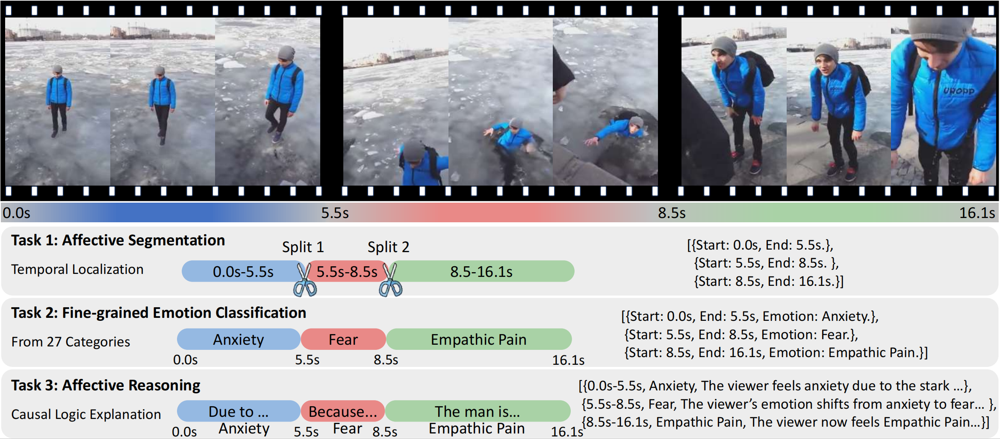
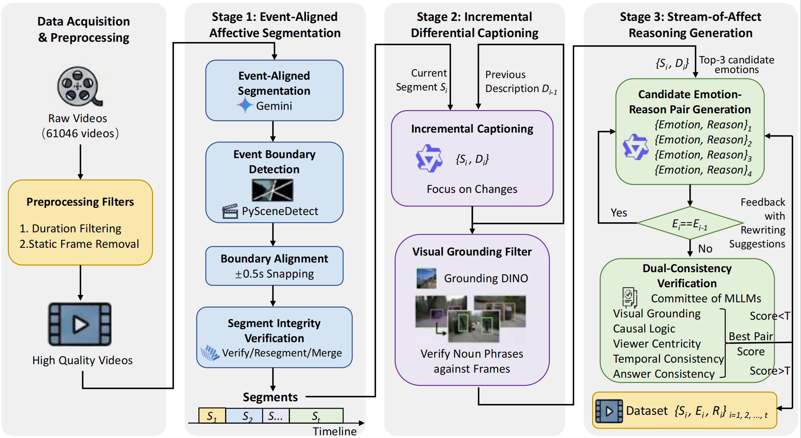

<h1 align="center">
Benchmarking Dynamic Affective Reasoning: A Viewer-Centric Video Emotion Dataset
</h1>

<div align="center">
  <a href="https://arxiv.org/pdf/2607.10238">
    
  </a> &nbsp;
  <a href="https://github.com/Zhang-Zhiyan/DAR">
    
  </a> &nbsp;
  <a href="https://github.com/Zhang-Zhiyan/DAR">
    
  </a> &nbsp;
  <a href="https://huggingface.co/datasets/aiaiaizzy/DAR-R1">
    
  </a> &nbsp;
  <a href="https://huggingface.co/aiaiaizzy/DAR-R1">
    
  </a>
  <br>
</div>

<div align="center">
  <a href="image/task.png"></a>
</div>

---

## 🔍 Overview

DAR is a viewer-centric video emotion benchmark for dynamic affective reasoning. Instead of assigning a single static label to a whole clip, DAR asks a model to identify when the viewer's emotion changes, what the fine-grained emotion is, and why the visual event triggers that affective reaction.

The benchmark contains 15,087 videos, 36,908 event-aligned affective segments, and 27 emotion categories. Each segment includes a temporal span, an emotion label, and a visually grounded causal rationale.

Dataset annotations are available at [Hugging Face Datasets](https://huggingface.co/datasets/aiaiaizzy/DAR-R1).
The original videos come from [hendrycks/emodiversity](https://github.com/hendrycks/emodiversity); please download the videos from the original project and follow its license and usage terms.

Model weights are available on [Hugging Face](https://huggingface.co/aiaiaizzy/DAR-R1) and [ModelScope](https://www.modelscope.cn/models/zzy220/DAR-R1).

## 🏗️ Data Construction

The construction pipeline follows three stages.

1. Event-aligned affective segmentation: Gemini-2.5-Pro proposes semantic event boundaries; PySceneDetect detects visual cuts and snaps nearby boundaries within a 0.5s window; InternVL3.5 verifies event integrity.
2. Incremental differential captioning: Qwen3-VL describes each segment while focusing on changes relative to the previous segment. Description generation does not use emotion labels.
3. Stream-of-affect reasoning: Qwen3-VL uses segment descriptions and Top-3 candidate emotions to generate ranked emotion-reason pairs. Qwen3-Omni and InternVL3.5 then judge visual grounding, causal logic, viewer centricity, temporal consistency, and answer consistency.

<div align="center">
  <a href="image/dataset_pipeline.png"></a>
</div>

Run the full pipeline:

```bash
export DATASET_ROOT=/path/to/DAR/raw_dar
export QWEN3VL_MODEL=/path/to/Qwen3-VL-32B-Instruct
export QWEN3_OMNI_MODEL=/path/to/Qwen3-Omni
export INTERNVL35_MODEL=/path/to/InternVL3_5-38B-HF
export GEMINI_API_KEY=<YOUR_API_KEY>

bash data_construction/run_data_construction_pipeline.sh
```

Run a small shard:

```bash
START_INDEX=0 END_INDEX=99 bash data_construction/run_data_construction_pipeline.sh
```

## 🧩 Cold-Start SFT

DAR-SFT adapts Qwen2.5-VL-3B-Instruct to the structured DAR output format. The paper configuration freezes the vision encoder and fine-tunes the LLM and aligner for 0.5 epoch with AdamW and learning rate `1e-5`.

Set up the SFT environment first:

```bash
conda create -n qwen3vl python=3.10.19 -y
conda activate qwen3vl

pip install -r qwen-vl-finetune/scripts/environment_qwen3vl_packages.txt
```

```bash
cd qwen-vl-finetune

export DAR_SFT_JSONL=/path/to/DAR/train.jsonl
export MODEL_PATH=/path/to/Qwen2.5-VL-3B-Instruct
export OUTPUT_DIR=/path/to/outputs/dar_sft_qwen25vl_3b
export CUDA_VISIBLE_DEVICES=0,1,2,3

bash scripts/sft.sh
```

## ⚡ GRPO Training

DAR-R1 initializes from the DAR-SFT checkpoint and uses GRPO to refine temporal localization, emotion prediction, and reasoning quality. The paper configuration trains for 1 epoch with learning rate `2e-6`.

Set up the GRPO environment first:

```bash
conda create -n qwen3vlrl python=3.10.19 -y
conda activate qwen3vlrl

pip install -r ms-swift/examples/train/grpo/dar/environment_qwen3vlrl_packages.txt
```

```bash
cd ms-swift/examples/train/grpo/dar

export MODEL_NAME=/path/to/outputs/dar_sft_qwen25vl_3b
export SOURCE_SFT_JSONL=/path/to/DAR/train.jsonl
export DATA_JSONL=/path/to/DAR/train_qwen25vl_ms_grpo.jsonl
export OUTPUT_DIR=/path/to/outputs/dar_r1_grpo_qwen25vl_3b
export CUDA_VISIBLE_DEVICES=0,1,2,3

bash train_qwen2.5vl_grpo_dar.sh
```

The launcher converts DAR-SFT JSONL into ms-swift GRPO format before training. Set `PREPARE_DATA=0` if the converted JSONL already exists.

## 📊 Evaluation

Use `test.py` for inference and evaluation:

```bash
python test.py \
  --model-path /path/to/DAR-R1 \
  --test-jsonl /path/to/DAR/test.jsonl \
  --video-root /path/to/DAR/videos \
  --output-jsonl /path/to/outputs/dar_r1_test_predictions.jsonl \
  --batch-size 8
```

## 📌 Notes

- All default paths in this repository are placeholders. Replace `/path/to/...` with local paths or set the corresponding environment variables.
- The videos remain under the license of their original sources.
- The repository includes adapted training code from upstream Qwen and ms-swift components. Please follow their licenses when redistributing modified code.

## 🤝 Acknowledgements

We thank the authors of [emodiversity](https://github.com/hendrycks/emodiversity), [Qwen](https://github.com/QwenLM/Qwen3-VL), [ms-swift](https://github.com/modelscope/ms-swift) and [PySceneDetect](https://github.com/Breakthrough/PySceneDetect) for their publicly available resources and tools.

## 📝 License

This project is released under the [Apache License 2.0](LICENSE). The original videos remain governed by the license and usage terms of [emodiversity](https://github.com/hendrycks/emodiversity) and their original sources. Upstream Qwen and ms-swift components follow their respective licenses.

## Citation

```bibtex
@misc{zhang2026benchmarkingdynamicaffectivereasoning,
      title={Benchmarking Dynamic Affective Reasoning: A Viewer-Centric Video Emotion Dataset}, 
      author={Zhiyan Zhang and Peipei Song and Jinpeng Hu and Jingyang Jia and Xun Yang and Xiaojun Chang},
      year={2026},
      eprint={2607.10238},
      archivePrefix={arXiv},
      primaryClass={cs.CV},
      url={https://arxiv.org/abs/2607.10238}, 
}
```
